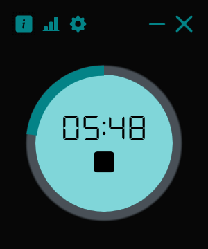
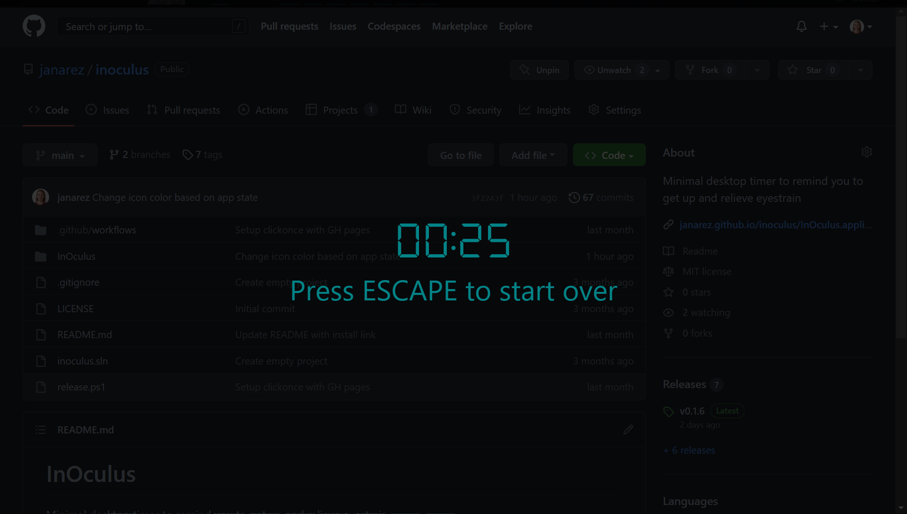

<h1 align="center"> InOculus</h1>

Minimal desktop timer to remind you to get up and relieve eyestrain.

  <a href="#about">About</a> •
  <a href="#install">Install</a> •
  <a href="#license">License</a>

&nbsp;

## About

InOculus is a simple desktop timer designed to push you towards taking breaks from computer screen.

It automatically cycles between focus and break intervals. During focus the InOculus timer counts down remaining focus time. During break a break screen with countdown appears on all monitors and counts down remaining break time. If needed the break screen can be dismissed straight away.

 

### Features

- Custom focus and break intervals
- Multi-monitor support for break screen
- Slick design using your Windows color theme
- Option to open app on startup
- Visual indicator of application state (running, stopped, etc.) through taskbar icon color
- Timer updates in thumbnail even if app is minimized
- Quick control from thumbnail
- One click installation and updates

### Name

InOculus was created to help protect eyes by relieving eyestrain. The name is derived from Latin and means In 'in' + Oculus 'eye' that is "in the eye". Simultaneously, it spells and reads similarly to the English word innocuous meaning 'not harmful'.

## Install

You can download the Windows (10+) [ClickOnce](https://learn.microsoft.com/en-us/visualstudio/deployment/clickonce-security-and-deployment) application at https://janarez.github.io/inoculus/InOculus.application.

You'll also need to install [.NET Desktop Runtime 6](https://get.dot.net/6) if you don't already have it.

Each time new version of the app is released, ClickOnce will notify you of the update and allow you to install it with single click.

## License

InOculus is released under [MIT license](./LICENSE).
